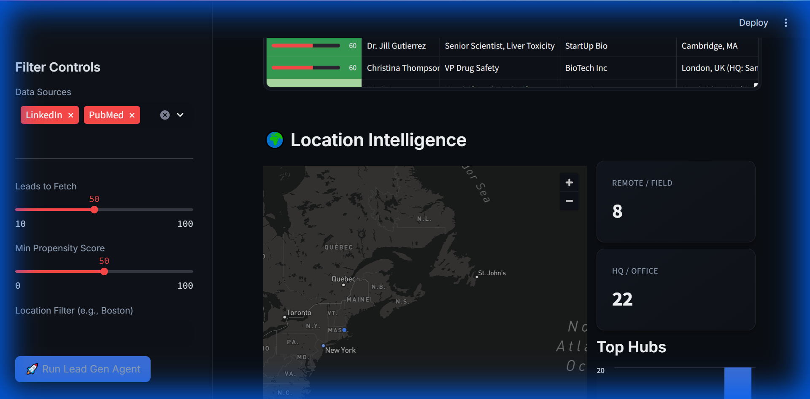

# 🧬 AI Lead Generation Dashboard

A sales intelligence tool for the biotech industry, designed to identify, enrich, and rank potential customers for **3D in-vitro model therapies**. This project replicates the premium aesthetics of the "Castle Roads" design system.

## 🌟 Key Features

*   **Location Intelligence Map**: Interactive 3D visualization of lead clusters in major biotech hubs (Boston, SF, Basel, etc.).
*   **Smart Feed**: Aggregates leads from mock sources including **LinkedIn** (Corporate) and **PubMed** (Academic).
*   **Premium Dark UI**: A modern interface featuring glassmorphism, the **Inter** font, and a cohesive dark theme.
*   **Propensity Scoring**: An AI-driven ranking engine that prioritizes the highest-value opportunities.



---

## 🎯 How Propensity Scoring Works

The dashboard doesn't just list name; it prioritizes them. The **Propensity Score (0-100)** predicts the likelihood of a sale based on weighted signals detected in the lead's profile.

### The Algorithm

| Criterion | Weight | Logic |
| :--- | :--- | :--- |
| **Scientific Intent** | **+40** | High current interest. Awarded for recent publications or active research in relevant fields. |
| **Role Fit** | **+30** | Awarded for high-value titles (e.g., "Director of Toxicology", "Head of Safety"). |
| **Company Intent** | **+20** | Awarded if the company has recently received funding or is expanding. |
| **Technographic** | **+15** | Awarded if the organization uses compatible technology stacks. |
| **Location** | **+10** | Awarded for presence in a major innovation hub (e.g., Cambridge, MA). |

### 🔍 Example Calculation: Dr. Ames

Consider a lead named **Dr. Ames**. Why is he ranked #1?

*   **✅ +40 Scientific Intent**: He recently published a paper on "Liver Toxicity Models".
*   **✅ +30 Role Fit**: His title is "Director of Toxicology".
*   **✅ +15 Technographic**: His company uses compatible assay mechanisms.
*   **TOTAL SCORE: 85/100** (Very High Probability)

This ensures your sales team talks to **Dr. Ames** first, rather than wasting time on low-probability leads.

---

## 🛠️ Tech Stack

*   **Python 3.12**
*   **Streamlit**: For the web application framework.
*   **PyDeck**: For the 3D map visualization.
*   **Faker**: For generating realistic synthetic datasets.

## 🚀 Getting Started

### 1. Installation
Clone the repository and install the dependencies.

```bash
pip install -r requirements.txt
```

### 2. Run the App
Launch the dashboard in your local browser.

```bash
streamlit run app.py
```

## 📂 Project Structure

```
├── app.py                  # Main application entry point
├── requirements.txt        # Python dependencies
├── src/
│   ├── data_sources/       # Generators for LinkedIn & PubMed data
│   │   └── mock_data.py    # Shared constants (Hubs, Companies)
│   ├── enrichment/         # Geo & Contact enrichment logic
│   └── ranking/            # Propensity scoring engine
└── tests/                  # Verification scripts
```
